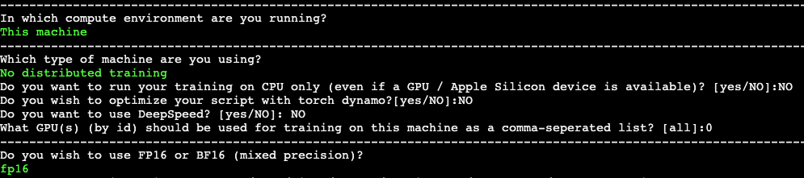

<p align="center">
  <h1 align="center">DragDiffusion: Harnessing Diffusion Models for Interactive Point-based Image Editing</h1>
  <p align="center">
    <a href="https://yujun-shi.github.io/"><strong>Yujun Shi</strong></a>
    &nbsp;&nbsp;
    <strong>Chuhui Xue</strong>
    &nbsp;&nbsp;
    <strong>Jiachun Pan</strong>
    &nbsp;&nbsp;
    <strong>Wenqing Zhang</strong>
    &nbsp;&nbsp;
    <a href="https://vyftan.github.io/"><strong>Vincent Y. F. Tan</strong></a>
    &nbsp;&nbsp;
    <a href="https://songbai.site/"><strong>Song Bai</strong></a>
  </p>
  <div align="center">
    
  </div>
  <br>
  <p align="center">
    <a href="https://arxiv.org/abs/2306.14435">[arXiv paper]</a>
    <a href="https://yujun-shi.github.io/projects/dragdiffusion.html">[Project Page]</a>
    <a href="https://twitter.com/YujunPeiyangShi"></a>
  </p>
  <br>
</p>

## Disclaimer
This is a research project, NOT a commercial product.

## Installation

It is recommended to run our code on a Nvidia GPU with a linux system. We have not yet tested on other configurations.

To install the required libraries, simply run the following command:
```
conda env create -f environment.yaml
conda activate dragdiff
```

## Run DragDiffusion
Before running DragDiffusion, you might need to set up "accelerate" with the following command:
```
accelerate config
```
In all our experiments, we used the following configuration for "accelerate":
<p align="center">
    </img>
</p>

#### Step 1: train a LoRA
1) To train a LoRA on our input image, we first put the image under a folder. Note that this folder should **ONLY** contain this one image.
2) Then, we set "SAMPLE\_DIR" and "OUTPUT\_DIR" in the script "lora/train\_lora.sh" to be proper values. "SAMPLE\_DIR" should be the directory containing our input image; "OUTPUT\_DIR" should be the directory where we want to save the trained LoRA.
3) Also, we need to set the option "--instance\_prompt" in the script "lora/train\_lora.sh" to be a proper prompt. Note that this prompt does NOT have to be a complicated one. Examples of prompts (i.e., prompts used in our Demo video) are given in "lora/samples/prompts.txt".
4) Finally, After the "lora/train\_lora.sh" file has been configured properly, run the following command to train a LoRA:
```
bash lora/train_lora.sh
```

#### Step 2: do "drag" editing
After training the LoRA, we can now run the following command to start the gradio user interface:
```
python3 drag_ui_real.py
```

Please refer to our [Demo video](https://yujun-shi.github.io/projects/dragdiffusion.html) to see how to do the "drag" editing.

The editing process is consist of the following steps:
1) Drop our input image into the left-most box.
2) Draw a mask in the left-most box to specify the editable areas.
3) Click handle and target points in the middle box. Also, you may reset all points by clicking "Undo point".
4) Input "prompt" and "lora path". "lora path" is the **directory** storing our trained LoRA; "prompt" should be the same prompt we used to train our LoRA.
5) Finally, click the "Run" button to run our algorithm. Edited results will be displayed in the right-most box.

Explanation for parameters in the user interface:

|Parameter|Explanation|
|-----|------|
|prompt|The prompt describing the user input image (This needs to be the same as the prompt used to train LoRA).|
|lora_path|The path to the trained LoRA|
|n_pix_step|Maximum number of steps of motion supervision. Increase this value if handle points have not been "dragged" to desired position.|
|lam|The regularization coefficient controlling unmasked region stays unchanged. Increase this value if the unmasked region has changed more than what was desired (do not have to tune in most cases).|
|n_actual_inference_step|Number of DDIM inversion steps performed (do not have to tune in most cases).|


## Acknowledgement
This work is inspired by the amazing [DragGAN](https://vcai.mpi-inf.mpg.de/projects/DragGAN/). The lora training code is modified from an [example](https://github.com/huggingface/diffusers/blob/v0.17.1/examples/dreambooth/train_dreambooth_lora.py) of diffusers. Image samples are collected from [unsplash](https://unsplash.com/), [pexels](https://www.pexels.com/zh-cn/), [pixabay](https://pixabay.com/). Finally, a huge shout-out to all the amazing open source diffusion models and libraries.


## License
Code related to the DragDiffusion algorithm is under Apache 2.0 license.


## BibTeX
```bibtex
@article{shi2023dragdiffusion,
  title={DragDiffusion: Harnessing Diffusion Models for Interactive Point-based Image Editing},
  author={Shi, Yujun and Xue, Chuhui and Pan, Jiachun and Zhang, Wenqing and Tan, Vincent YF and Bai, Song},
  journal={arXiv preprint arXiv:2306.14435},
  year={2023}
}
```

## TODO
- [ ] Upload trained LoRAs of our examples
- [ ] Support arbitrary size input
- [ ] Integrate the lora training function into the user interface.
- [ ] Try to use another user interface that can respond faster.


## Contact
For any questions on this project, please contact [Yujun](https://yujun-shi.github.io/) (shi.yujun@u.nus.edu)

